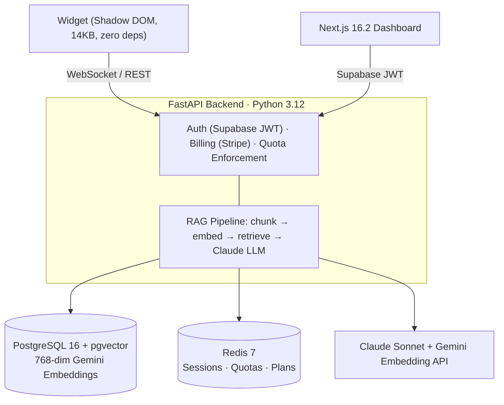
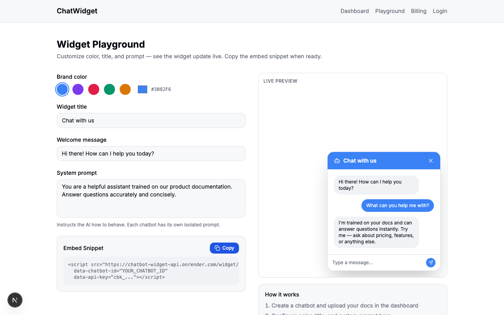
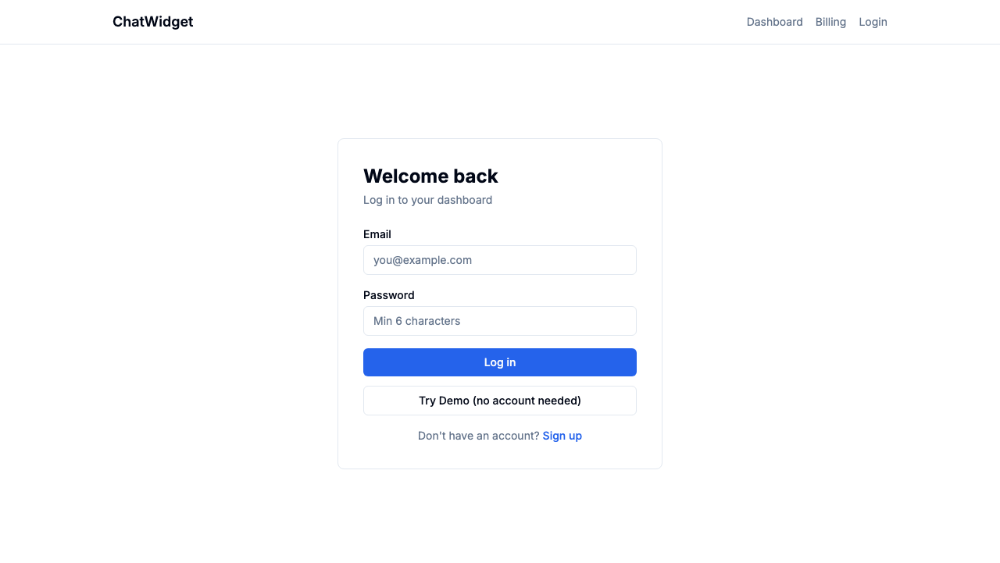
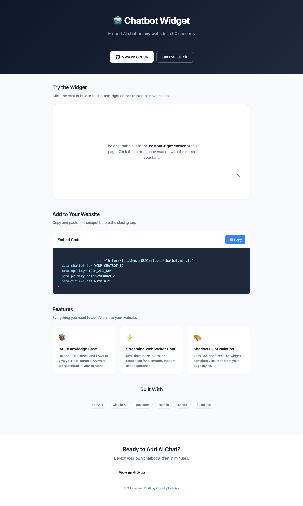

[](https://chatbot-widget-dashboard.vercel.app)

# DinqAgent — Powered by Lucy

Embeddable AI chatbot with full SaaS infrastructure - auth, billing, RAG knowledge base, analytics, and a Next.js 15 dashboard. Drop a single `<script>` tag on any website and get a streaming AI chat widget backed by Claude, pgvector retrieval, and Stripe subscriptions.

```html
<script src="https://dinqagent.dinqdigital.com/widget/lucy.min.js"
        data-chatbot-id="YOUR_CHATBOT_ID"
        data-api-key="YOUR_API_KEY"
        data-primary-color="#2563EB"
        data-title="Chat with Lucy"></script>
```

---

## Architecture



See [Architecture Decision Records](docs/adr/) for detailed rationale behind key technical choices.

### Shadow DOM Widget Isolation

The embeddable chat widget uses Shadow DOM for complete isolation:
- Zero CSS conflicts with the host page styles
- ~14KB minified bundle with no framework dependency
- Security boundary: widget DOM is inaccessible to host page scripts
- Drop-in embed: `<script src="widget.js" data-chatbot-id="..."></script>`

### Widget Playground

The dashboard includes a [live playground](/dashboard/app/playground/page.tsx) for configuring and previewing widgets before embedding:
- Real-time color customization with preset palette and custom hex picker
- Editable widget title, welcome message, and system prompt
- Live preview that updates instantly as you change settings
- One-click copy of the ready-to-paste `<script>` embed snippet



## For Hiring Managers

| If you're evaluating for... | Where to look | What it demonstrates |
|-----------------------------|--------------|---------------------|
| **Full-Stack AI / SaaS** | Widget embed ([`widget/src/chatbot.js`](widget/src/chatbot.js)), REST + WebSocket chat routes, Stripe billing | End-to-end product: embed script, auth, billing, RAG, analytics |
| **RAG / Retrieval** | Embedder service ([`api/services/embedder.py`](api/services/embedder.py)), chunker, pgvector retrieval | Production RAG pipeline with Gemini embeddings + cosine similarity |
| **Backend / API Design** | FastAPI app ([`api/main.py`](api/main.py)), async SQLAlchemy models, Redis session management | Clean async Python, Pydantic validation, WebSocket streaming |
| **Frontend / Embeddable** | Shadow DOM widget ([`widget/src/chatbot.js`](widget/src/chatbot.js)) -- 14KB, zero dependencies, CSS isolation | Vanilla JS engineering without framework bloat |

---

## Tech Stack

| Layer | Technology |
|-------|-----------|
| **API** | FastAPI, Python 3.12+, async SQLAlchemy, Pydantic v2 |
| **LLM** | Claude Sonnet (Anthropic) |
| **Embeddings** | Gemini Embedding via `google-genai` (768-dim) |
| **Vector Store** | pgvector on PostgreSQL 16 |
| **Cache / State** | Redis 7 (sessions, quotas, subscription state) |
| **Auth** | Supabase JWT (signup/login/me) |
| **Billing** | Stripe Checkout + Customer Portal + Webhooks |
| **Dashboard** | Next.js 16.2, TypeScript, Tailwind CSS, Supabase JS |
| **Widget** | Vanilla JS, Shadow DOM isolation, ~14KB minified |
| **CI** | GitHub Actions |

## API Reference

### Health

| Method | Endpoint | Auth | Description |
|--------|----------|------|-------------|
| `GET` | `/health` | -- | Health check (db + redis status) |

### Auth

| Method | Endpoint | Auth | Description |
|--------|----------|------|-------------|
| `POST` | `/auth/signup` | -- | Create account (Supabase), returns JWT |
| `POST` | `/auth/login` | -- | Login, returns JWT |
| `GET` | `/auth/me` | Bearer JWT | Current user info |

### Chatbots

| Method | Endpoint | Auth | Description |
|--------|----------|------|-------------|
| `GET` | `/api/v1/chatbots` | Bearer JWT | List user's chatbots |
| `POST` | `/api/v1/chatbots` | `X-Admin-Key` | Create chatbot (admin) |
| `POST` | `/api/v1/chatbots/me` | Bearer JWT | Create chatbot (user) |
| `GET` | `/api/v1/chatbots/{id}` | `X-Admin-Key` | Get chatbot details |
| `PUT` | `/api/v1/chatbots/{id}` | `X-Admin-Key` | Update chatbot |
| `DELETE` | `/api/v1/chatbots/{id}` | `X-Admin-Key` | Soft-delete chatbot |
| `GET` | `/api/v1/chatbots/{id}/widget-config` | -- | Public widget display config |

### Documents (RAG Knowledge Base)

| Method | Endpoint | Auth | Description |
|--------|----------|------|-------------|
| `POST` | `/api/v1/chatbots/{id}/documents` | `X-Admin-Key` | Upload PDF/TXT (max 10MB) |
| `GET` | `/api/v1/chatbots/{id}/documents` | `X-Admin-Key` | List knowledge base docs |
| `DELETE` | `/api/v1/chatbots/{id}/documents/{doc_id}` | `X-Admin-Key` | Delete document + chunks |

### Chat

| Method | Endpoint | Auth | Description |
|--------|----------|------|-------------|
| `POST` | `/api/v1/chat/{id}` | API key (optional) | REST chat (non-streaming) |
| `WS` | `/ws/chat/{id}?session_id=&api_key=` | API key (optional) | WebSocket streaming chat |

### Webhooks

| Method | Endpoint | Auth | Description |
|--------|----------|------|-------------|
| `POST` | `/api/v1/chatbots/{id}/webhooks` | Bearer JWT | Register webhook endpoint (HMAC-signed delivery) |
| `GET` | `/api/v1/chatbots/{id}/webhooks` | Bearer JWT | List webhook endpoints |
| `DELETE` | `/api/v1/chatbots/{id}/webhooks/{wh_id}` | Bearer JWT | Delete webhook endpoint |
| `GET` | `/api/v1/chatbots/{id}/webhooks/{wh_id}/deliveries` | Bearer JWT | View delivery history + dead-letter log |

### Leads

| Method | Endpoint | Auth | Description |
|--------|----------|------|-------------|
| `POST` | `/api/v1/chat/{id}/leads` | -- | Capture visitor lead (email, name) before chat |
| `GET` | `/api/v1/chatbots/{id}/leads` | -- | List captured leads |

### Analytics

| Method | Endpoint | Auth | Description |
|--------|----------|------|-------------|
| `GET` | `/api/v1/chatbots/{id}/analytics` | Bearer JWT | Message count, conversation count, avg messages |
| `GET` | `/api/v1/chatbots/{id}/analytics/performance` | Bearer JWT | Avg response time, escalation rate, unanswered rate |
| `GET` | `/api/v1/chatbots/{id}/analytics/export` | Bearer JWT | Export conversations as CSV or JSON with date filtering |
| `GET` | `/api/v1/chatbots/{id}/analytics/timeseries` | Bearer JWT | Daily message counts for last N days |
| `GET` | `/api/v1/chatbots/{id}/conversations` | Bearer JWT | Recent conversations (filter by `needs_review`) |

### Billing

| Method | Endpoint | Auth | Description |
|--------|----------|------|-------------|
| `POST` | `/billing/checkout` | Bearer JWT | Create Stripe Checkout session |
| `POST` | `/billing/portal` | Bearer JWT | Open Stripe Customer Portal |
| `POST` | `/billing/webhook` | Stripe signature | Handle subscription lifecycle events |

### Widget

| Method | Endpoint | Auth | Description |
|--------|----------|------|-------------|
| `GET` | `/widget/chatbot.js` | -- | Serve widget source |
| `GET` | `/widget/chatbot.min.js` | -- | Serve minified widget |
| `GET` | `/widget/demo` | -- | Interactive widget demo page |
| `GET` | `/demo` | -- | Portfolio-quality demo page with live widget embed |
| `POST` | `/auth/demo-login` | -- | Demo login (returns `demo-token`; requires `DEMO_MODE=true`) |

## Plan Tiers

| | **Free** | **Pro** ($49/mo) | **Business** ($149/mo) |
|---|---------|-----------------|----------------------|
| Messages/month | 100 | 5,000 | 50,000 |
| Chatbots | 1 | 5 | Unlimited |
| Knowledge base | 10MB | 500MB | Unlimited |
| Analytics | Basic | Full | Full + export |
| Support | Community | Email | Priority |

## Environment Variables

| Variable | Required | Description |
|----------|----------|-------------|
| `DATABASE_URL` | Yes | PostgreSQL connection string (`postgresql+asyncpg://...`) |
| `REDIS_URL` | Yes | Redis connection string |
| `ANTHROPIC_API_KEY` | Yes | Anthropic API key for Claude |
| `ADMIN_KEY` | Yes | Protects admin management endpoints (`X-Admin-Key` header) |
| `SECRET_KEY` | Yes | Application secret key |
| `SUPABASE_URL` | Yes* | Supabase project URL (required for auth) |
| `SUPABASE_SERVICE_ROLE_KEY` | Yes* | Supabase service role key (required for auth) |
| `SUPABASE_JWT_SECRET` | Yes* | JWT secret for token verification (required for auth) |
| `STRIPE_SECRET_KEY` | Yes* | Stripe secret key (required for billing) |
| `STRIPE_WEBHOOK_SECRET` | Yes* | Stripe webhook signing secret (required for billing) |
| `STRIPE_PRO_PRICE_ID` | No | Stripe Price ID for Pro plan |
| `STRIPE_BUSINESS_PRICE_ID` | No | Stripe Price ID for Business plan |
| `DEMO_MODE` | No | Enable demo login + demo chatbot resolution (`true`/`false`, default `false`) |
| `NEXT_PUBLIC_DEMO_MODE` | No | Show "Try Demo" button on dashboard login page (`true`/`false`) |
| `NEXT_PUBLIC_API_URL` | No | Backend API URL for dashboard (defaults to `http://localhost:8000`) |

*Required for production. API runs without these in development mode.

## Live Demo

- **Dashboard**: [chatbot-widget-dashboard.vercel.app](https://chatbot-widget-dashboard.vercel.app) - "Try Demo" button on the login page (no account needed)
- **Widget demo page**: `GET /demo` - portfolio-quality showcase with live widget, copy-paste embed snippet, and cold-start indicator

### Dashboard Login (with demo button)


### Demo Page


Run locally:
```bash
DEMO_MODE=true uvicorn api.main:app --reload
# then open http://localhost:8000/demo
```

## Self-Hosting

```bash
git clone https://github.com/ChunkyTortoise/chatbot-widget.git
cd chatbot-widget
cp .env.example .env
# Edit .env with your credentials

docker-compose up -d
```

This starts PostgreSQL 16 (with pgvector), Redis 7, and the FastAPI API on port 8000.

## Development Setup

### API (Python)

```bash
python -m venv .venv && source .venv/bin/activate
pip install -r requirements.txt

# Start infrastructure
docker-compose up -d db redis

# Run API
uvicorn api.main:app --reload
```

### Dashboard (Next.js 16.2)

```bash
cd dashboard
npm install
npm run dev
```

### Widget

```bash
# Build minified widget
make widget
# Output: widget/dist/chatbot.min.js
```

Visit `http://localhost:8000/widget/demo` to see the widget in action.

## Tests

```bash
# Python
pytest tests/ -v

# Dashboard TypeScript (13 tests)
cd dashboard && npm test

# Total: 161 tests
```

## Widget Embed Options

| Attribute | Default | Description |
|-----------|---------|-------------|
| `data-chatbot-id` | *required* | Chatbot UUID from API |
| `data-api-key` | -- | API key for authenticated access |
| `data-position` | `bottom-right` | `bottom-right` or `bottom-left` |
| `data-primary-color` | `#2563EB` | Hex color for bubble and header |
| `data-title` | `Chat with Lucy` | Header title text |

## Deploy to Render

1. Connect this repo to [Render](https://render.com)
2. Use `render.yaml` -- provisions API, PostgreSQL, and Redis automatically
3. Set environment variables in the Render dashboard

## License

MIT
